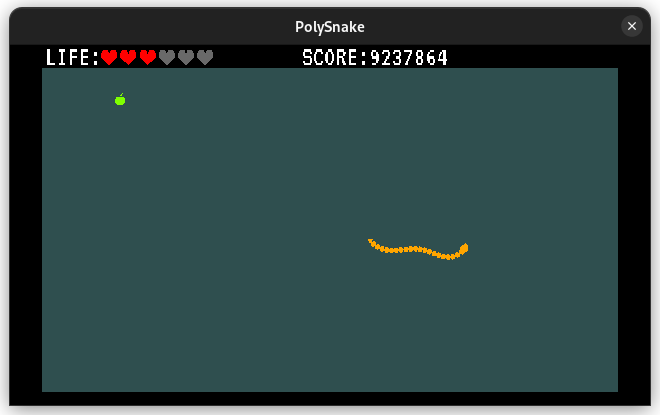

# Polygonal Snake

Project goal is write from scratch 2D Snake in .net 6. 
On this moment I implemented movement based on inverse kinematics.  
Next step will be explore this path adding some physics.

Use for this project:
- OpenTK 
- OpenGL4

Support platform:
- Linux
- Windows 10

Keyboard control:
- **A** turn left
- **D** turn right
- **R** reset snake
- **Esc** exit