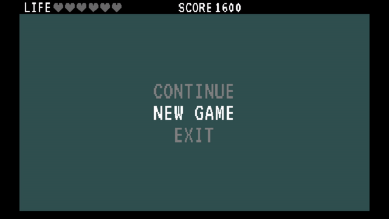

# Polygonal Snake

## [live demo](https://elaborate-lily-2c0859.netlify.app)

Project goal is write from scratch 2D Snake in **.net 6**.  
This project contains port for Blazor Server and Webassembly.
I adding Blazor for proof of concept. Game on Blazor don't
works 100% same way like desktop version.
Weird problem is with floating-point numbers. Is behave differently
between Desktop and Blazor.
And this create some problems with proper calculation.
For reduce problem I don't use **double**. But when I try
investigate problem farther, I start feel more confused.

## Used for this project

- libraries:
    - OpenTK
    - OpenGL4
- tools:
    - Rider
    - Blender

## Supported platform

- Linux
- Windows
- WebBrowser (experimental)

## Keyboard control

| Function      | Keys   |        |
|---------------|--------|------------|
| Menu          | Escape |      |
| Option Up     | W      | ArrowUp    |
| Option Down   | S      | ArrowDown  |
| Accept Option | Space  | Enter      |
| Turn Left     | A      | ArrowLeft  |
| Turn Right    | D      | ArrowRight |

## Install and run

### Download code.

> git clone https://github.com/3mam/PolySnake.git

> cd PolySnake

### Run desktop version.

> dotnet run --project Poly

### Run browser version.

Blazor server.
> dotnet run --project BlazorServer

In browser go to this url.
> https://localhost:5267

Blazor webassembly.
> dotnet run --project BlazorWasm

In browser go to this url.
> https://localhost:5249

## Build

> cd Poly

For Windows.
> dotnet publish -c Release --runtime win-x64

For Linux.
> dotnet publish -c Release --runtime linux-x64